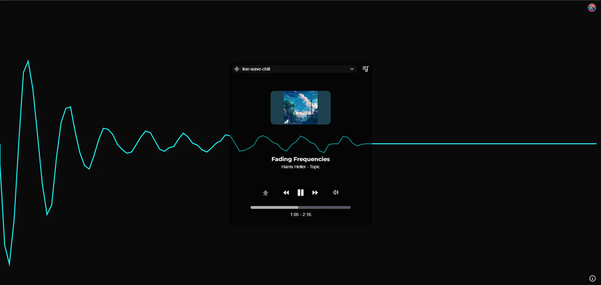
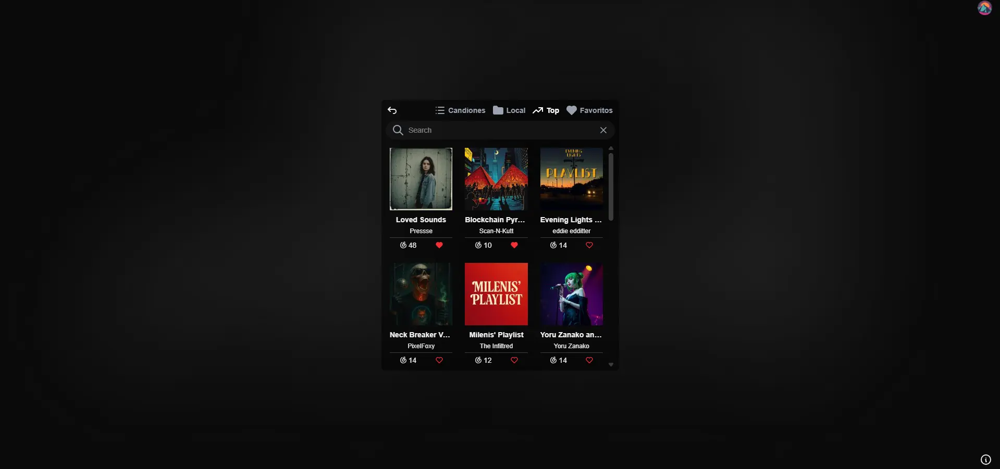

# My Playlist

## 📝 Descripción del proyecto: 
**MyPlaylist** es una aplicacion web para escuchar las mejores playlist sin interrupciones. creada con [Nextjs](https://nextjs.org/),  [Clerk](https://clerk.com/), [MongoDB](https://www.mongodb.com/) y [Api Audius](https://audius.org/en/api) .

## 🚀 Enlace a la demo:
Accede a la app desplegada en Vercel: https://myplaylist-kappa.vercel.app/

## 📷 Capturas de pantalla

## 🔧 Explicación de cómo se ha utilizado Clerk: 

Se ha implementado [Clerk](https://clerk.com/) para gestionar la autenticación de usuarios, permitiendo así guardar y visualizar sus playlists favoritas.

## 🗒️ Nota
Proyecto desarrollado para la [hackaton-clerk-2025](https://github.com/midudev/hackaton-clerk-2025?tab=readme-ov-file#%EF%B8%8F-c%C3%B3mo-participar-en-la-hackat%C3%B3n).